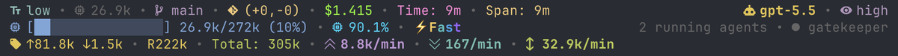
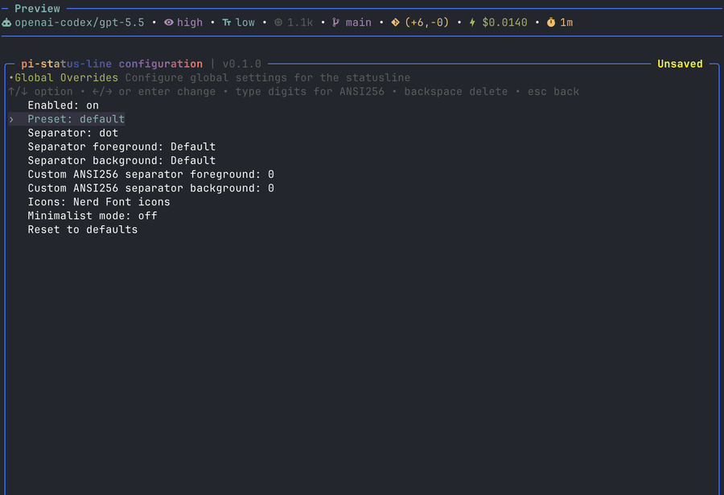
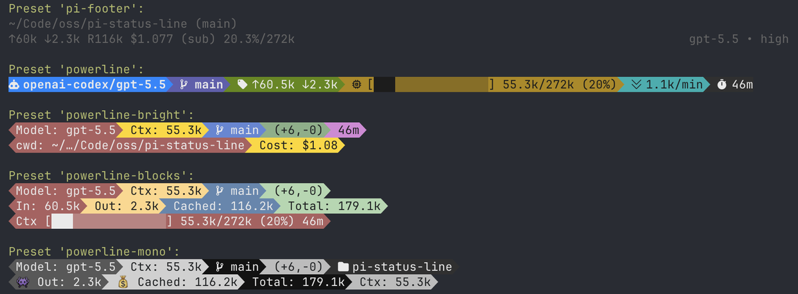
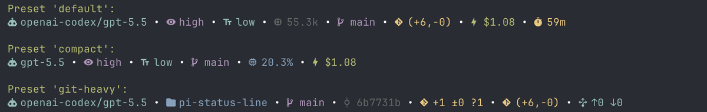

# pi-status-line

A configurable, Ultimate multi-line footer/statusline extension for [`pi`](https://pi.dev).



`pi-status-line` is built for people who live in the terminal and want their agent UI to expose useful state at a glance: model, provider, context, tokens, cost, git state, session activity, extension statuses, and custom values published by other extensions.



## Why use it?

- **Make pi feel like your editor.** Pick a compact, plain, or powerline-style footer and tune every segment.
- **See important agent state without opening menus.** Model, reasoning level, verbosity, context usage, token counts, cost, git info, session stats, and more.
- **Give other extensions a place to speak.** Extensions can publish values through `pi.events` or `ctx.ui.setStatus(...)`, and users decide where those values appear.
- **Experiment safely.** The config UI gives a live preview, but only writes to disk when you explicitly save.

### Complete demo video

<details>
<summary>Click to expand video</summary>

<video src="assets/demo-video.mp4" controls muted></video>

</details>

## Install

Install extension from npm:

```bash
pi install npm:pi-status-line
```

Try it for one run without installing:

```bash
pi -e npm:pi-status-line
```

Local development checkout:

```bash
npm install
pi -e ./src/index.ts
```

## Quick start

Open the configuration UI:

```text
/statusline
```

Try a preset:

```text
/statusline preset powerline
/statusline preset powerline-bright
/statusline preset powerline-blocks
/statusline preset powerline-mono
/statusline preset pi-footer
/statusline preset compact
```

Other quick commands:

```text
/statusline on
/statusline off
/statusline reset
```

Settings are persisted to:

```text
~/.pi/agent/extensions/pi-status-line.json
```

Override with `PI_STATUSLINE_CONFIG=/path/to/settings.json`.

## Presets

Presets are starting points. After applying one, you can edit lines, widgets, separators, colors, icons, and terminal behavior in the config UI.

| Preset | Best for | Notes |
| --- | --- | --- |
| `default` | Everyday use | Balanced model/context/git/cost/session layout. |
| `compact` | Narrow terminals | Uses full width minus 40 columns and a tighter widget set. |
| `powerline` | A clean colored powerline footer | Uses Nerd Font icons, explicit colored separator widgets, and no global separator. |
| `powerline-bright` | A colorful two-line powerline layout | Inspired by ccstatusline-style bright blocks. |
| `powerline-blocks` | Multi-line blocky powerline layouts | Demonstrates multiline styling, token rows, and context blocks. |
| `powerline-mono` | High-contrast monochrome powerline | Gray/black palette inspired by terminal powerline themes. |
| `git-heavy` | Git-heavy workflows | Emphasizes cwd, branch, sha, status, diff, and upstream info. |
| `pi-footer` | Default pi-like footer | Dimmed with pi theme colors; uses full cwd, bracketed branch, session name, pi-style token/cost/cache formatting, context percentage/window, subscription marker, and right-aligned model/thinking. |
| `demo` | Preset gallery | Demo preset combines `pi-footer` and **powerline** presets. |
| `demo-standard` | Standard preset gallery | Demo preset for the standard non-powerline presets. |

**demo preset:**



**demo-standard preset:**



The `pi-footer` preset is intended to look like pi's built-in footer while staying editable. It follows the active pi theme.

Powerline presets look best with a Nerd Font-compatible terminal font.

## Configuration UI

```text
/statusline
```

Main menu:

- **Edit lines** — add, clone, move, delete, and select statusline rows.
- **Edit colors** — choose a line, then configure widget foreground/background/bold.
- **Terminal Options** — configure terminal width behavior and color level.
- **Global Overrides** — choose presets, separators, icon mode, minimalist mode, and global separator colors.
- **Pi extensions** — choose which published extension statuses appear in the extension status row.
- **Save & Exit** — explicitly save the current configuration.
- **Exit without saving** — discard changes and restore the last saved config.

Common keys:

| Key | Action |
| --- | --- |
| `↑` / `↓` | Select item |
| `page up` / `page down` | Jump through long lists |
| `enter` | Open/select/change |
| `a` | Add line/widget |
| `c` | Clone line/widget |
| `w` / `s` | Move line/widget up/down |
| `d` | Delete line/widget |
| `space` | Enable/disable widget |
| `r` | Toggle raw value in the widget list |
| `ctrl+s` | Save without closing |
| `esc` | Back/close; dirty exit asks for confirmation |

### Save/discard behavior

The UI updates the live preview immediately while you edit. Disk writes only happen when you explicitly save:

- `ctrl+s`
- `Save & Exit`
- confirm save from the unsaved-changes dialog

If you exit without saving, the runtime config is restored to the last saved config.

The title shows inline config state: `Unsaved`, `Saving…`, `Saved`.

## Widgets

Widgets are instance-based. You can add the same widget multiple times, clone it, disable individual instances, and customize each instance separately.

Every non-layout widget supports common options: **Enabled**, **Raw value only**, **Hide when empty** where relevant, **Custom icon**, foreground/background/bold colors, and ANSI256 overrides.

The **Value example** column shows the widget value before labels/icons and colors are applied. In normal mode, statusline prefixes non-layout widgets with the selected emoji, Nerd Font icon, text label, or custom icon. `Raw value only` and minimalist mode render the raw value directly.

### Core widgets

| Widget | Shows | Widget-specific options | Value example |
| --- | --- | --- | --- |
| `Model` | Active model id. | Show provider. | `claude-sonnet-4-5` |
| `Provider` | Active model provider. | — | `anthropic` |
| `Provider/Model` | Provider and model together. | — | `anthropic/claude-sonnet-4-5` |
| `Thinking Level` | Current pi thinking/reasoning level. Hidden when unavailable. | — | `high` |
| `Text Verbosity` | Text verbosity for providers that expose it. Hidden when unavailable. | — | `low` |
| `Context Window` | Model context window size. | Token format, hide when zero. | `200k` |
| `Working Dir` | Current working directory. | Display style: default, full `~`, fish-style; segment count. | `~/…/projects/pi-status-line` |
| `Working Dir Name` | Basename of current working directory. | — | `pi-status-line` |
| `Session Name` | pi session display name. | Text when empty, hide when empty. | `release prep` |
| `Active Tools` | Count of active tools. | — | `4` |
| `Pi Event Value` | Value published through `pi.events`. | Widget ID, text when empty, hide when empty. | `on` |
| `Pi Extension Status` | Value published by another extension through `ctx.ui.setStatus`. | Status key, trim value, preserve trim styles, text when empty, hide when empty. | `fast` |

### Tokens, context, and cost widgets

| Widget | Shows | Widget-specific options | Value example |
| --- | --- | --- | --- |
| `Input/Output Tokens` | Session input and output token totals. | Token format. | `↑42k ↓8.4k` |
| `Input Tokens` | Session input token total. | Token format, hide when zero. | `42k` |
| `Output Tokens` | Session output token total. | Token format, hide when zero. | `8.4k` |
| `Total Tokens` | Total tokens from usage records. | Token format, hide when zero. | `182.4k` |
| `Cache Read` | Cache-read token total. | Token format, hide when zero. | `120k` |
| `Cache Write` | Cache-write token total. | Token format, hide when zero. | `12k` |
| `Context Length` | Current context token estimate/usage. | Token format, conditional colors, hide when zero. | `50k` |
| `Context %` | Used context percentage. | Conditional colors. | `25%` |
| `Context Remaining` | Remaining context percentage. | Conditional colors. | `75%` |
| `Context Bar` | Progress bar plus context usage. | Display: default, short, short-only, medium; token format; conditional colors. | `[████████░░░░░░░░░░░░░░░░░░░░░░░░] 50k/200k (25%)` |
| `Session Cost` | Estimated session cost. | Cost format, show subscription marker. | `$0.1234` |
| `Input Speed` | Average input tokens per minute across transcript span. | Token format, hide when zero. | `20.1k/min` |
| `Output Speed` | Average output tokens per minute across transcript span. | Token format, hide when zero. | `1.1k/min` |
| `Total Speed` | Average total tokens per minute across transcript span. | Token format, hide when zero. | `21.2k/min` |

### Session widgets

| Widget | Shows | Widget-specific options | Value example |
| --- | --- | --- | --- |
| `Message Counts` | User/assistant/tool result counts. | — | `7u/6a/12t` |
| `User Messages` | User message count. | — | `7` |
| `Assistant Messages` | Assistant message count. | — | `6` |
| `Tool Results` | Tool result count. | — | `12` |
| `Total Messages` | Total user, assistant, and tool messages. | — | `25` |
| `Transcript Span` | Time between first and latest recorded session entry. | — | `1h 12m` |
| `Session Total Time` | Live wall-clock time since first session entry. | — | `1h 20m` |
| `Session Start` | First session entry time. | — | `09:41` |
| `Last Activity` | Most recent session entry time. | — | `11:06` |
| `Session ID` | Current pi session id. | — | `018f1234` |
| `Compactions` | Number of compaction summaries. | — | `1` |

### Git widgets

| Widget | Shows | Widget-specific options | Value example |
| --- | --- | --- | --- |
| `Git Branch` | Current Git branch. | Display: plain, round brackets, custom surround; hide when empty. | `main` or `(main)` |
| `Git SHA` | Short `HEAD` commit SHA. | Hide when empty. | `a1b2c3d` |
| `Git Root Dir` | Repository root directory name. | Hide when empty. | `pi-status-line` |
| `Git Status` | Staged, unstaged, and untracked file counts. | Hide when empty. | `+2 ±3 ?1` |
| `Git Diff` | Uncommitted insertion/deletion summary. | Display: plain or compact; hide when empty. | `+42/-10` or `(+42,-10)` |
| `Git Clean Status` | Clean/dirty repository state. | Hide when empty. | `clean` or `dirty` |
| `Git Staged Files` | Staged file count. | Hide when empty. | `2` |
| `Git Unstaged Files` | Unstaged file count. | Hide when empty. | `3` |
| `Git Untracked Files` | Untracked file count. | Hide when empty. | `1` |
| `Git Insertions` | Uncommitted insertion count. | Hide when empty. | `42` |
| `Git Deletions` | Uncommitted deletion count. | Hide when empty. | `10` |
| `Git Ahead/Behind` | Ahead/behind counts relative to upstream. | Hide when empty. | `↑1 ↓0` |
| `Git Remote` | `origin` remote URL. | Hide when empty. | `git@github.com:user/repo.git` |

### Custom and layout widgets

| Widget | Shows | Widget-specific options | Value example |
| --- | --- | --- | --- |
| `Custom Text` | Literal user-defined text. | Text. | `prod` |
| `Separator` | Explicit separator segment. | Separator style; custom text for custom separator. | ` • `, ` \| `, `-`, `,` |
| `Spacer` | Fixed blank space. | Width from 1 to 40. | `<empty space>` |
| `Flex Separator` | Invisible split point that pushes following widgets to the right side. | — | `left widgets <---> right widgets` |

## Styling

### Icon modes

Supported icon modes: Emoji, Nerd Font icons, Text labels.

Individual widgets can override their icon with **Custom icon**.

### Colors

Each widget supports:

- foreground
- background
- bold
- custom ANSI256 foreground/background (`0-255`)

Foreground colors also include pi theme colors such as `Pi Dim`, `Pi Accent`, `Pi Warning`, and `Pi Error`. These follow the active pi theme and are useful for native-looking presets like `pi-footer`.

In color editing:

- `←` / `→` cycle/change
- type digits to edit ANSI256 values
- backspace deletes one digit
- values over `255` clamp to `255`

Terminal color levels: Truecolor, 256 Color, Basic 16-color, No Color.

### Separators

Global separator modes: `none`, `dot`, `pipe`, `space`, `powerline`, `dash`, `comma`

Global separator foreground/background colors apply only to automatic separators inserted between widgets.

Separator widgets are independent. They have their own separator style and colors and are not affected by global separator colors.

Powerline-oriented separator widget styles include hard transitions, soft transitions, and caps. The powerline presets use explicit separator widgets so transitions can be colored segment-by-segment.

### Terminal width modes

- `Full width always`
- `Full width minus 40` - truncates the statusline to fit within `terminal width - 40` columns.

The `compact` preset uses `Full width minus 40`; other presets use full width.

## Extension integration

`pi-status-line` exposes two integration paths for extension authors.

### 1. Event widgets

Add a `Pi Event Value` widget and set its `Widget ID` to a stable value, for example `fast_mode` or `service_tier`.

Other extensions can update that widget through pi's shared event bus:

```typescript
pi.events.emit("pi-status-line:update-widget", {
  widgetId: "fast_mode",
  value: "on",
});
```

Clear a previously published value by sending `null`:

```typescript
pi.events.emit("pi-status-line:update-widget", {
  widgetId: "fast_mode",
  value: null,
});
```

Values are live/in-memory. After reload or session switch, publisher extensions should emit their current value again.

### 2. Pi extension statuses

Extensions can publish status text through pi's UI API:

```typescript
const STATUS_KEY = "my-extension";

ctx.ui.setStatus(STATUS_KEY, "fast");
```

Users can display that value in two ways:

- add a `Pi Extension Status` widget and set `Status key` to `my-extension`
- show/hide it in the `Pi extensions` menu for the extension status row

Multiple widgets may point at the same status key. `pi-status-line` does not auto-hide or deduplicate extension statuses; the user controls what appears.

Use **Trim value** on a `Pi Extension Status` widget to remove leading visible characters from the published status. For example, trim `2` turns `● On`, `● Enabled`, or `◌ Disabled` into `On`, `Enabled`, or `Disabled`. **Preserve trim styles** is enabled by default, so whole-status ANSI styling is replayed after the trimmed prefix; turn it off to drop styling that was attached only to the trimmed prefix.

Incoming ANSI styling from extension statuses is preserved by default. If the user sets a custom foreground/background/bold override on the `Pi Extension Status` widget, incoming ANSI is stripped first so the user override wins cleanly.

## Development

```bash
npm run lint
npm run fmt
npm run typecheck
npm run test
```

## Credits

- [@sirmalloc](https://github.com/sirmalloc) for [`ccstatusline`](https://github.com/sirmalloc/ccstatusline) inspiration.
- [@badlogic](https://github.com/badlogic) for [`pi`](https://pi.dev) and its built-in footer.

## License

MIT
